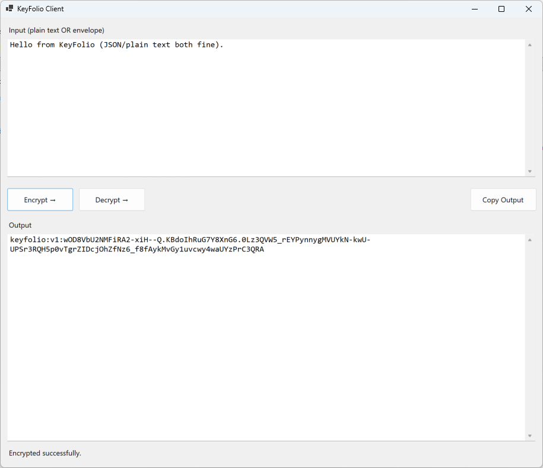

<!-- Readme/getting-started.html -->
<!doctype html>
<html lang="en">
<head>
  <meta charset="utf-8" />
  <meta name="viewport" content="width=device-width, initial-scale=1" />
  <title>Getting Started • KeyFolio.Client Docs</title>

  <!-- Match index.html wiring (adjust paths to match your site) -->
  <link rel="stylesheet" href="assets/site.css" />
</head>

<body>
  <!-- Header / Nav -->
  <header class="topbar">
    

      <a class="brand" href="./index.html">KeyFolio.Client Docs</a>

      <nav class="nav">
        <a href="./index.html">Home</a>
        <a class="active" href="./getting-started.html">Getting Started</a>
        <a href="./security-model.html">Security Model</a>
        <a href="./workflows.html">Workflows</a>
        <a href="./troubleshooting.html">Troubleshooting</a>
      </nav>
    

  </header>

  <main class="page">
    

      <h1>Getting Started</h1>
      

        <b>KeyFolio.Client</b> is intended for interactive use by a human. It wraps
        <b>KeyFolio.Core</b> with guardrails and visual feedback.
      

      <section class="card">
        <h2>Prereqs</h2>
        <ul>
          <li>.NET SDK: <b>net8.0-windows</b></li>
          <li>Windows desktop environment (WinExe)</li>
          <li>Access to the shared passphrase (via <code>KEYFOLIO_SECRET</code> or prompt)</li>
        </ul>
      </section>

      <section class="card">
        <h2>Build & Run</h2>

        

          <b>Note:</b> Unlike MailFolio or Console tools, the Client is designed to slow users down
          and prevent accidental disclosure.
        

        <ol>
          <li>Open a terminal in the <code>KeyFolio.Client</code> project folder.</li>
          <li>Run the standard build sequence:</li>
        </ol>

        <pre><code>dotnet clean
dotnet restore
dotnet build -c Release</code></pre>

        

          You can also run in Debug from Visual Studio, or run the built exe from the output folder
          after a successful build.
        

      </section>

      <section class="card">
        <h2>Provide the passphrase</h2>
        

          KeyFolio.Client never stores passphrases. You provide it at runtime:
        

        <h3>Option A: Environment Variable</h3>
        <pre><code># PowerShell
$env:KEYFOLIO_SECRET = "CorrectHorseBatteryStaple"</code></pre>

        <h3>Option B: Prompt</h3>
        

          If <code>KEYFOLIO_SECRET</code> is missing, the app will show a secure prompt and cache the
          passphrase in memory for the current session only.
        

      </section>

      <section class="card">
        <h2>First encryption</h2>
        <ol>
          <li>Paste plaintext into <b>Input</b> (JSON or plain text is fine).</li>
          <li>Click <b>Encrypt</b>.</li>
          <li>Copy the resulting <b>envelope string</b> from <b>Output</b>.</li>
        </ol>

        

          

            <!-- Screenshot placeholder -->
            
          

          

            Screenshot placeholder: replace <code>assets/img/placeholder-getting-started.png</code>
            with a real capture when ready.
          

        

      </section>

      <section class="card">
        <h2>First decryption</h2>
        <ol>
          <li>Paste an envelope string into <b>Input</b>.</li>
          <li>Click <b>Decrypt</b>.</li>
          <li>The plaintext will appear in <b>Output</b> if the passphrase matches.</li>
        </ol>
      </section>

      <section class="card">
        <h2>What you’re looking at in the code</h2>
        <ul>
          <li><code>Program.cs</code> boots WinForms and opens <code>Form1</code>.</li>
          <li><code>Form1</code> wires <b>Encrypt</b>, <b>Decrypt</b>, and <b>Copy Output</b> to <code>KeyFolio.Core</code>.</li>
          <li><code>EnvOrPromptSecretProvider</code> gets <code>KEYFOLIO_SECRET</code> or prompts the user.</li>
          <li><code>SecretPromptForm</code> is the modal prompt with “Show passphrase”.</li>
        </ul>
      </section>

      <section class="card">
        <h2>Quick concepts</h2>
        <h3>Envelope strings</h3>
        

          An envelope string is an encrypted representation of a secret. It is safe to store and transport,
          but useless without the correct passphrase.
        

        <h3>Client vs Console</h3>
        

          Console tools assume expert users. Client tools assume caution, confirmation, and visual clarity.
        

      </section>

      <footer class="footer">
        Last opened: 
      </footer>

    

  </main>

  <!-- Match index.html wiring (adjust paths to match your site) -->
  
</body>
</html>
